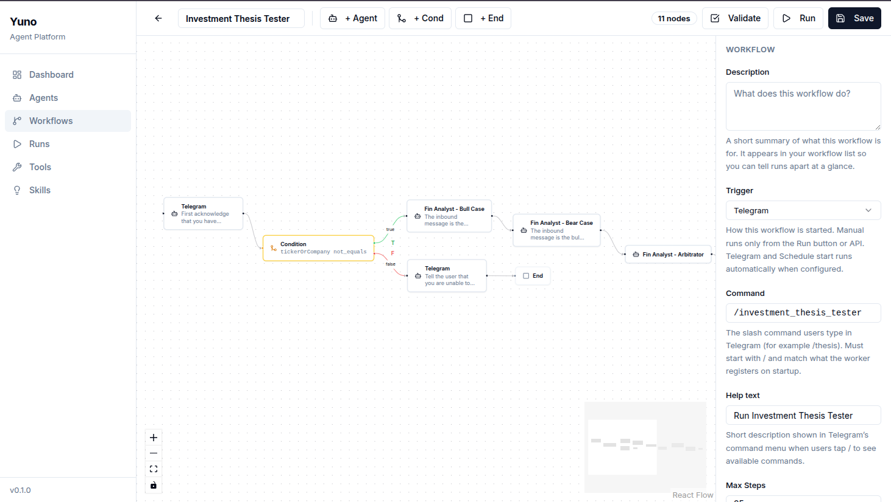
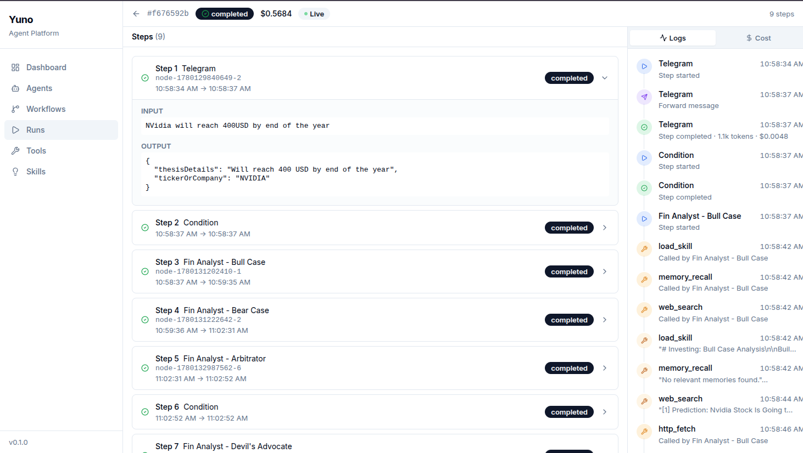
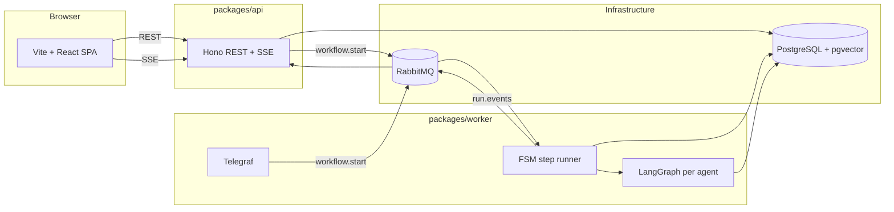

# AI Agent Orchestration Platform

Configure AI agents (prompt, model, tools, skills, memory, guardrails, channels), compose them into cyclic graph workflows, and run them on a durable runtime with async inter-agent messaging, live observability, and Telegram as an external channel.

---

<p align="center">
  
</p>
<p align="center">
  
</p>


## Quick start

**Prerequisites:** Node.js LTS, [pnpm](https://pnpm.io) 10+, Docker.

```bash
cp .env.example .env   # Paste in the keys provided in the application
pnpm demo              # or: ./demo.sh
```

[`demo.sh`](demo.sh) is the one-command setup: install deps, start Docker (Postgres + RabbitMQ), wait for DB, migrate, seed, then run API, worker, and web. `pnpm demo` is a shorthand that invokes the same script. Press Ctrl+C to stop; Docker services are torn down on exit.

Open [http://localhost:5173](http://localhost:5173) for the dashboard. Message your Telegram bot with `/` to see registered commands (`/thesis`, `/hire` after seed).

---

## Architecture

Three deployables in one monorepo: **API** (Hono REST + SSE), **Worker** (FSM orchestrator, LangGraph agent runtime, Telegraf, scheduler), **Web** (Vite + React). One PostgreSQL (pgvector) and one RabbitMQ.



### Repo layout

```
.
├── docker-compose.yaml       # init dev infra: postgres (pgvector), rabbitmq
└── packages/
    ├── shared/               # Zod schemas, RunEvent union, LLM prices
    ├── db-adapter/           # Prisma schema, migrations, seed
    ├── api/                  # Hono server
    ├── worker/               # orchestrator, runtime, tools, telegram
    └── web/                  # Vite + React SPA
```

---

## Concepts

### Agents

User-configurable units: system prompt, role, model, temperature, tools, skills, memory (private vs shared, semantic vs recency), guardrails (input/output denylist, PII redaction), and channels (`internal`, `telegram`). **Interaction rules** from the challenge brief are modeled as workflow edges and conditions, not a separate agent field.

### Skills

Reusable instruction packs stored in the DB, seeded from `skills/*/SKILL.md` (frontmatter + body). Selected skills append to the system prompt; their `requiredTools` merge into the agent’s tool set.

### Workflows

Cyclic graphs: **agent** nodes (task + optional structured `outputSchema`), **condition** nodes (typed expressions on the predecessor’s output), **end** nodes. Triggers: `manual`, `telegram_message` (`/command`), or `schedule` (cron). `maxSteps` bounds total node visits; intra-agent ReAct is capped separately by `recursionLimit`.

### Memory

PostgreSQL + pgvector via `MemoryService`:

- **Private:** `agent:<agentId>` — persists across runs for that agent.
- **Shared:** `workflow_run:<runId>` — all agents with `scope: shared` on that run.

Passive recall injects context before each invocation; agents can also call `memory.recall` / `memory.write` tools.

---

## Design decisions

**TypeScript:** One language across API, worker, and web; shared Zod contracts (For API request bodies and event payloads) in `packages/shared` and `packages/rmq`.

**LangGraph for intra-agent, custom FSM for inter-agent:** LangGraph owns a single ReAct invocation (tools, structured output). The worker orchestrator owns graph routing, conditions, loops, retries, and durability — no novel multi-agent protocol.

**RabbitMQ as a message bus:** Exchanges `workflow.start`, `workflow.steps`, `run.events`, plus a DLX for failed step jobs after retries. Matches production messaging patterns (retries, dead letters, inspectable queues for demos).

**Prisma as single schema owner for monolithic database:** All tables live in `packages/db-adapter`; API and worker import `@workspace/db-adapter`. Workflow `nodes` / `edges` are JSONB — whole-graph read/write, simple React Flow round-trip.

**Custom MemoryService over LangGraph stores:** Focused pgvector layer with explicit namespaces and strategies; clean separation from orchestration.

**SSE:** Perfect choice for half-duplex (server-only) communication to client. Run event logs flow from Worker -> API -> browser via an SSE connection opened on individual Workflow run screens on the UI.

**Telegram: command-based routing.** Each `/command` starts a fresh workflow run; no conversational capability due to lack of clarity on spec for interfacing between a workflow and conversation.

---

## Data model

All tables are Prisma-managed (see `packages/db-adapter/prisma/schema.prisma`):


| Table             | Role                                                  |
| ----------------- | ----------------------------------------------------- |
| `Agent`           | Agent configuration                                   |
| `Skill`           | Skill definitions                                     |
| `Workflow`        | Graph (`nodes`, `edges` JSON), triggers, `isTemplate` |
| `WorkflowRun`     | Run status, totals, trigger context                   |
| `WorkflowStep`    | Per-step input/output, status                         |
| `WorkflowMessage` | Inter-agent (and Telegram) messages                   |
| `AgentTrace`      | Per-LLM-call tokens, cost, latency                    |
| `Memory`          | pgvector-backed memory items                          |


Templates are workflows with `isTemplate = true`; **Clone** copies to a new workflow.

---

## API

REST + Zod validation (`packages/shared`). Base path `/api`.

```
GET/POST        /agents
GET/PUT/DELETE  /agents/:id

GET/POST        /skills
PUT/DELETE      /skills/:id

GET/POST        /workflows
GET/PUT         /workflows/:id
POST            /workflows/:id/clone
POST            /workflows/:id/run      # body: { initialInput }

GET             /runs?workflowId&status&limit&cursor
GET             /runs/:id               # snapshot
GET             /runs/:id/stream        # SSE

GET             /tools
GET             /models                 # filtered by env keys present
```

Errors: `{ error: { code, message, details? } }`.

---

## Observability & event delivery

**Live:** `GET /api/runs/:id/stream` (SSE). Worker publishes to `run.events` (`run.<runId>.<eventType>`); API binds ephemeral queues per connection.

**Persistent:** Every emit is dual-written — DB first (source of truth), then RMQ (best-effort).

**Semantics:** *At-most-once* live delivery; *exactly-once* durable state. Reconnecting clients receive a `snapshot` event, then live events.

### Cost methodology

Static per-model prices in `packages/shared/prices.ts`. Each LLM call in a ReAct loop writes an `AgentTrace` row; `step.completed` carries accumulated totals for that step. Prices are approximate — production would use provider billing APIs. Token usage is normalized across OpenAI, Anthropic, and Google in the worker.

---

## Tests

**Philosophy:** Pure-logic unit tests only — no DB, no mocked LLM e2e.


| Suite                            | Location                                             | Why                                      |
| -------------------------------- | ---------------------------------------------------- | ---------------------------------------- |
| Condition evaluator              | `packages/worker/src/orchestrator/eval-condition.ts` | Many ops; high silent-failure risk       |
| Edge resolution on cyclic graphs | `packages/worker/src/orchestrator/next-edges.ts`     | Feedback loops depend on correct routing |


```bash
pnpm test
```

---

## Known limitations

- **No multi-turn Telegram** — each `/command` starts a new run (extension: `chatId -> activeRunId` with TTL).
- **No intra-agent checkpointing** — worker crash mid-ReAct may re-run the whole agent step.
- **Guardrails are turn-level** — input message and final output only, not intermediate tool I/O.
- **PII redaction is regex-based** — demo-grade; production should use Presidio or similar.
- **Scheduler is best-effort** — 60s tick, single worker; production needs distributed locking.

---

## Future work

- Multi-turn Telegram sessions with explicit run binding and TTL
- `/cancel` and run-level cancellation
- Presidio (or equivalent) for PII

---

## Scripts


| Command           | Description                                                                     |
| ----------------- | ------------------------------------------------------------------------------- |
| `./demo.sh` / `pnpm demo` | One-command setup (see [demo.sh](demo.sh)) |
| `pnpm compose:up` | Start Docker services                                                           |
| `pnpm seed`       | Idempotent DB seed (skills, agents, templates)                                  |
| `pnpm start:be`   | API + worker                                                                    |
| `pnpm start:fe`   | Web dev server                                                                  |
| `pnpm test`       | Vitest unit tests                                                               |
